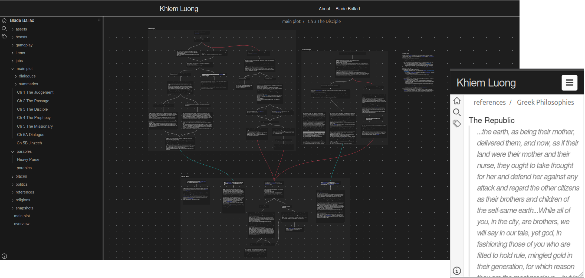

# jekyll-obsidian

**View <a href="https://obsidian.md/" target="_blank">Obsidian</a> vaults, on your <a href="https://jekyllrb.com/" target="_blank">Jekyll</a> website.**



jekyll-obsidian is designed to emulate as much of Obsidian's original look and feel, allowing your Obsidian vaults to be hosted on a static Jekyll site.

It should work out of the box if you use the default `minima` theme. Otherwise, you can modify the generated obsidian.scss and its partials. These .scss files are not overwritten when the site is served, and if you want to reset the styles, simply delete that modified .scss file and the gem will regenerate the default one.

Thank you to the developers of <a href="https://github.com/cure53/DOMPurify" target="_blank">DOMPurify</a>, <a href="https://github.com/js-cookie/js-cookie" target="_blank">js-cookie</a> (for saving color scheme), <a href="https://github.com/markdown-it/markdown-it" target="_blank">markdown-it</a> (for parsing `.md` notes), and <a href="https://github.com/jonobr1/two.js" target="_blank">two.js</a> (for drawing `.canvas` node edges).

# Features
This Jekyll plugin has all the core features of Obsidian, including:
- Backlinks
- Embeds
- Callouts
- Linked mentions
- Canvas
- File search
- Color schemes
- Mobile support

Some creative liberties were taken. For example, clicking on an image file will open a modal displaying it instead.

## Installation

Install the gem and add to the application's Gemfile by executing:

    $ bundle add jekyll-obsidian

If bundler is not being used to manage dependencies, install the gem by executing:

    $ gem install jekyll-obsidian

## Setup
1. First run `bundle exec jekyll build` to generate the necessary .css files for the _sass/obsidan partials.

2. Add the following to your site's `_config.yml`:
    ```yml
    plugins:
        - jekyll-obsidian
    ```
3. Drop your Obsidian vault folder into your site
4. Create a .markdown front matter file using the generated layout
    ```yml
    ---
    layout: obsidian
    title: Your Obsidian Vault
    permalink: /your-obsidian-vault/
    ---
    ```
5. In your `_config.yml`, set `obsidian_vault` to the root of the Obsidian vault
    > obsidian_vault: "Your Obsidian Vault"

    > obsidian_vault: "vaults/Another Obsidian Vault"
6. Run `bundle exec jekyll serve`, you should now see your Obsidian page at your given permalink

## Options
`obsidian_homepage`
Sets the homepage for your obsidian vault
> obsidian_homepage: "homepage.md"

> obsidian_homepage: "homecanvas.canvas"

`obsidian_backlinks`
Enables or disables backlinks, defaults to true
> obsidian_backlinks: false

`obsidian_embeds`
Enables or disables embeds, defaults to true
> obsidian_embeds: false


## Contributing

Bug reports and pull requests are welcome on GitHub at https://github.com/khiemgluong/jekyll-obsidian. This project is intended to be a safe, welcoming space for collaboration, and contributors are expected to adhere to the [code of conduct](https://github.com/[USERNAME]/jekyll-obsidian/blob/main/CODE_OF_CONDUCT.md).

## License

The gem is available as open source under the terms of the [MIT License](https://opensource.org/licenses/MIT).

## Code of Conduct

Everyone interacting in the jekyll-obsidian project's codebases, issue trackers, chat rooms and mailing lists is expected to follow the [code of conduct](https://github.com/khiemgluong/jekyll-obsidian/blob/main/CODE_OF_CONDUCT.md).
